<div align="center">

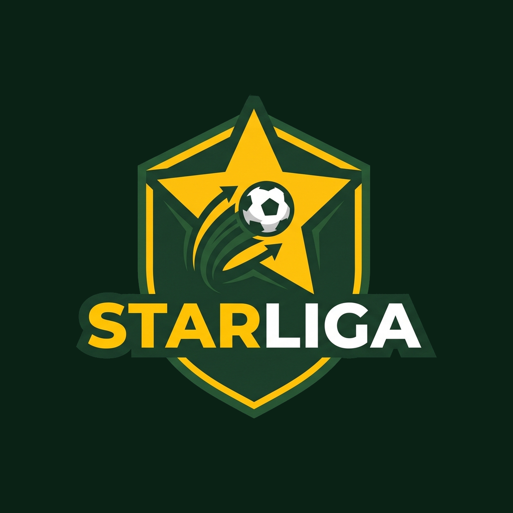

# ⚽ StarLiga | ستار ليغا
### *Modern Football Tournament & League Management Mobile Application*
#### *Architecture & Codebase Showcase*

[](https://flutter.dev)
[](https://dart.dev)
[-FF6F00)](#-system-architecture)
[](https://bloclibrary.dev)
[](#-private-api--architectural-notice)
[-success)](#-ui--design-system)

<br/>

> [!IMPORTANT]
> ### 🔒 Portfolio & Architectural Showcase Notice
> This repository is published as a **codebase showcase and engineering portfolio** demonstrating production-grade Flutter architecture, reactive state management using BLoC, and clean software design patterns. 
> 
> **The backend server, REST API endpoints, and configuration keys are private and proprietary to the StarLiga organization.** Consequently, files containing network addresses and private endpoints (`lib/core/api/` and `lib/core/constants/`) are intentionally excluded from version control (`.gitignore`). This repository is intended for **code review, architectural evaluation, and technical assessment** rather than out-of-the-box local execution.

</div>

---

## 📖 Table of Contents

- [📌 Project Overview](#-project-overview)
- [📸 Interface Showcase & App Previews](#-interface-showcase--app-previews)
- [✨ Key Modules & Features](#-key-modules--features)
- [📱 System Architecture](#-system-architecture)
- [📁 Project Directory Structure](#-project-directory-structure)
- [🔒 Private API & Architectural Notice](#-private-api--architectural-notice)
- [🧠 State Management & Data Flow](#-state-management--data-flow)
- [🏆 Tournament Rules & Business Logic](#-tournament-rules--business-logic)
- [🛠️ Tech Stack & Dependencies](#️-tech-stack--dependencies)
- [🎨 UI & Design System](#-ui--design-system)
  - [Color Tokens & Theme Palette](#color-tokens--theme-palette)
  - [Brand Identity & Iconography](#-brand-identity--iconography)

---

## 📌 Project Overview

**StarLiga** is a cross-platform mobile application designed to digitize and manage local and regional football tournaments. From club registration and squad management to multi-bracket tournament tables, chronological match event timelines, and detailed player performance statistics, StarLiga provides organizers, clubs, players, and fans with a modern, high-contrast tournament experience.

### Architectural Goals:
- **Clean Feature Decoupling**: Isolate UI presentation from data access and API interaction.
- **Predictable State Management**: Guarantee immutable, unidirectional data flow with `flutter_bloc`.
- **Arabic-First Design (RTL)**: Native Right-to-Left orientation using modern typography (**Tajawal**) and soccer pitch dark aesthetics.
- **Strict Data Integrity**: Enforce real-world tournament rules (player limits, role quotas, stage calculations) across UI and data validation layers.

---

## 📸 Interface Showcase & App Previews

A comprehensive visual walkthrough of StarLiga’s high-contrast **Stadium Pitch Dark** interface, customized for right-to-left Arabic typography, fluid animations, and real-time tournament operations.

### 🏟️ Matchday Experience & Live Feeds

| 🏠 League Hub (الرئيسية) | ⚽ Match Fixtures (المباريات) | ⏱️ Match Timeline (تفاصيل المباراة) |
| :---: | :---: | :---: |
| 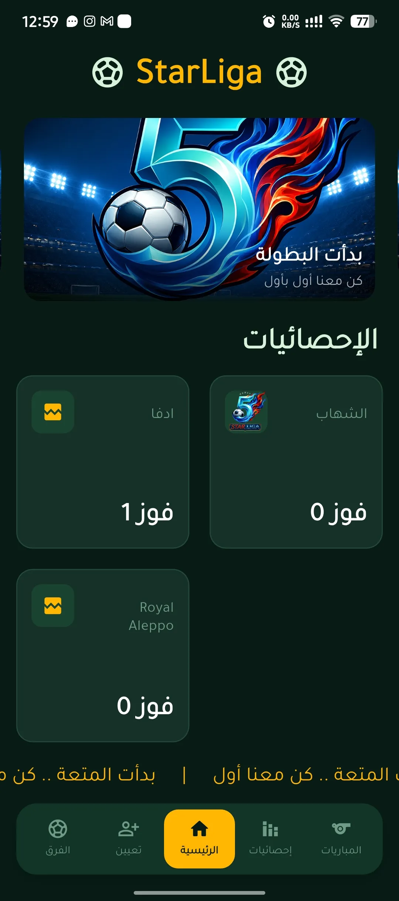 | 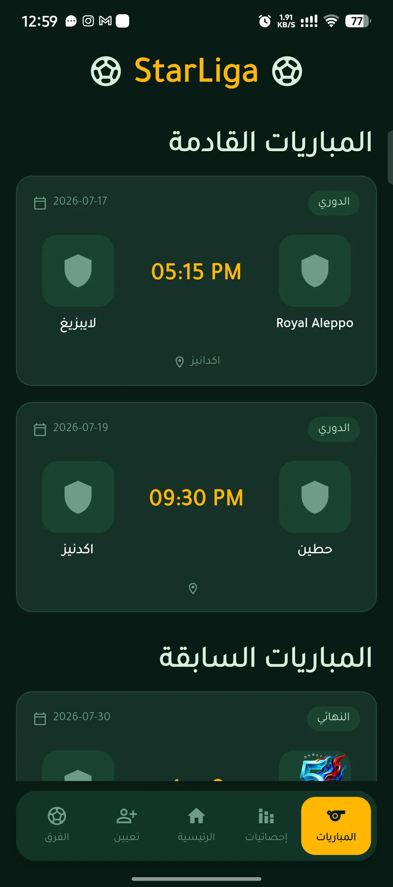 | 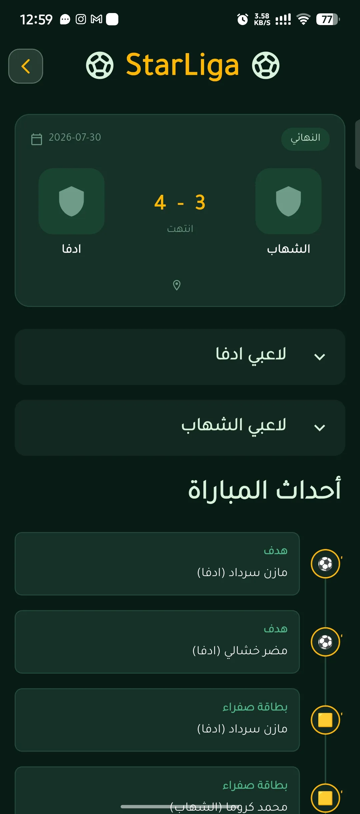 |
| **League Dashboard**<br/>• Auto-sliding news banner carousel<br/>• Smooth RTL breaking news ticker<br/>• Top clubs leaderboard spotlight | **Tournament Fixtures**<br/>• Filtered Upcoming vs. Past feeds<br/>• High-contrast club scoreboards<br/>• Venue, round, and kickoff time cards | **Live Match Details**<br/>• Chronological minute-by-minute timeline<br/>• Real-time goal (⚽) and card (🟨/🟥) tags<br/>• Collapsible team starting lineups |

### 📊 League Tables & Player Statistics

| 🏆 Tournament Standings (الترتيب) | 📈 Statistics & Top Scorers (الإحصائيات) | 🛡️ Clubs Directory (الفرق) |
| :---: | :---: | :---: |
| 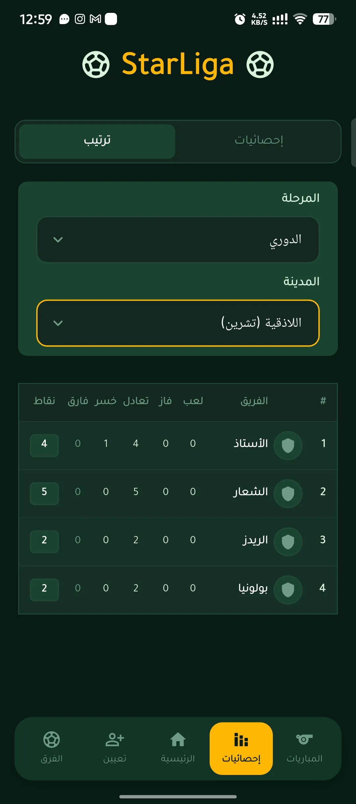 | 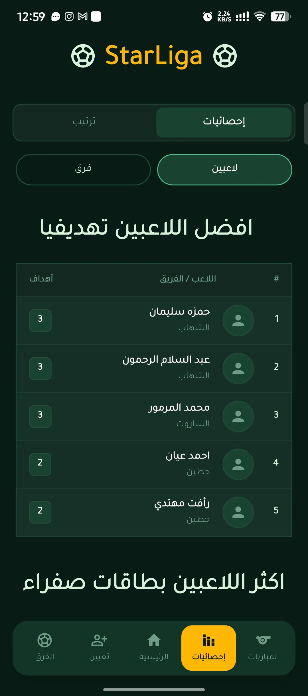 | 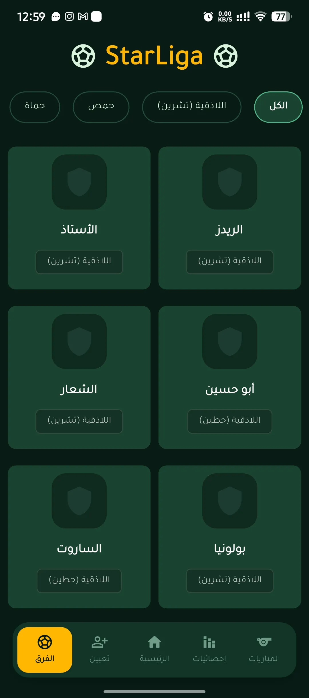 |
| **Multi-Stage Standings**<br/>• Group Stage & knockout phases<br/>• Points math: $(\text{Wins} \times 3) + (\text{Draws} \times 1)$<br/>• City / region filtering tabs | **Performance Analytics**<br/>• Golden Boot top scorers leaderboard<br/>• Player cards tracking (Yellow & Red)<br/>• Club-level disciplinary records | **Clubs Hub**<br/>• Fast municipal filter chips<br/>• Club crests and home cities<br/>• Squad sizes and aggregate goals scored |

### ✍️ Club Management & Dynamic Squad Builder

| 📋 Club Squad Roster (تفاصيل الفريق) | ✍️ Register Club (تعيين فريق) | 👤 Squad Builder (إضافة لاعب) |
| :---: | :---: | :---: |
| 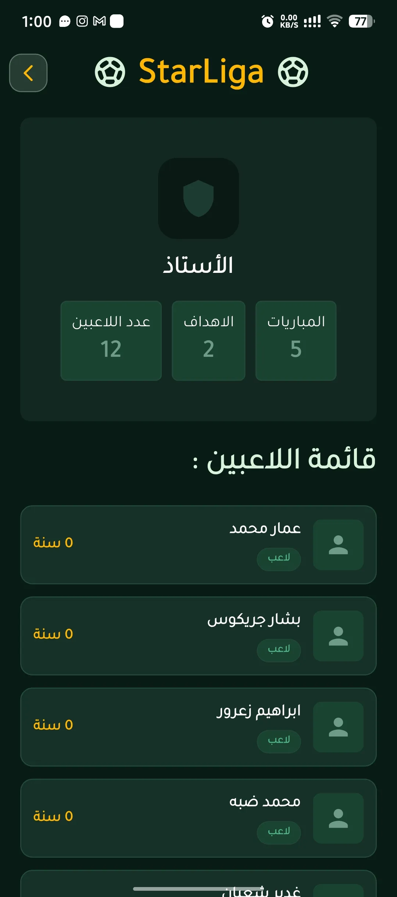 | 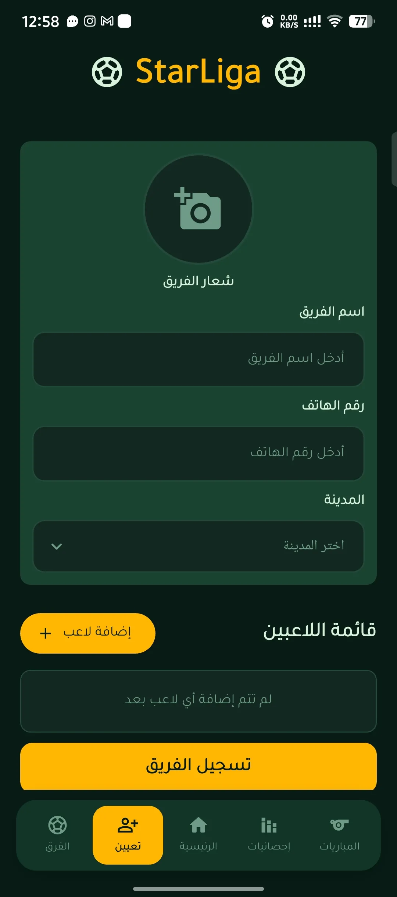 | 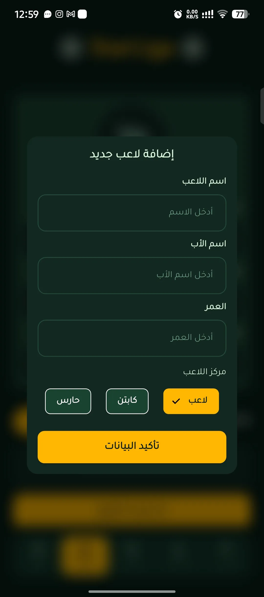 |
| **Club Profiles**<br/>• Comprehensive club metadata<br/>• Complete player squad roster<br/>• Role badges: Captain (`C`), GK, Player | **Club Registration**<br/>• Image picker for custom club crests<br/>• City dropdown dynamic selector<br/>• Squad count progress validation | **Squad Builder Dialog**<br/>• Modal dialog with backdrop blur<br/>• Mandatory quotas: 1 Captain & 1 GK<br/>• Enforced athletic age bounds (12–70) |

---

## ✨ Key Modules & Features

### 1. 🏠 League Hub & Dynamic Broadcast (الرئيسية)
> 📸 *UI Preview: [League Hub Screen (`home.webp`)](#-interface-showcase--app-previews)*
- **Visual News Carousel**: Interactive banner carousel (`carousel_slider`) featuring high-resolution tournament announcements and visual press releases with subtle gradient overlays.
- **Live News Ticker (Marquee)**: Smooth, horizontally scrolling RTL ticker bar (`marquee`) delivering instant tournament updates and breaking notices.
- **Top Teams Leaderboard Spotlight**: Dynamic grid spotlighting top-performing clubs and their accumulated win records.
- **Engaging Micro-Interactions**: Custom vector soccer ball loading animations powered by Lottie (`assets/animations/soccer-loading.json`).

### 2. 🛡️ Clubs Hub & Squad Rosters (الفرق)
> 📸 *UI Previews: [Clubs Directory (`teams.webp`)](#-interface-showcase--app-previews) • [Club Roster (`team_details.webp`)](#-interface-showcase--app-previews)*
- **Municipal / City Filtering**: Fast city-based filtering chips allowing users to browse clubs by geographical region.
- **Comprehensive Club Profiles**:
  - Club crest display, hometown municipality, and aggregate tournament statistics (squad size, goals scored, matches played).
  - Detailed player roster cards displaying player name, age, and designated role badge.

### 3. ✍️ Team Registration & Squad Builder (تعيين فريق)
> 📸 *UI Previews: [Team Registration (`add_team.webp`)](#-interface-showcase--app-previews) • [Squad Builder Dialog (`add_player_for_new_team.webp`)](#-interface-showcase--app-previews)*
- **Club Profile Registration**:
  - Image picker integration (`image_picker`) for uploading club logos and badges.
  - Team name and official contact phone number inputs with custom input formatters.
  - City dropdown selection populated dynamically from the backend.
- **Dynamic Squad Builder Modal (`AddPlayerDialog`)**:
  - Modal with backdrop blur to dynamically assemble the roster before final submission.
  - Role allocation: **Captain (كابتن - `C`)**, **Goalkeeper (حارس - `GK`)**, and **Outfield Player (لاعب - `P`)**.
  - Local validation for Arabic/alphabetic character sets and valid athletic age limits (12–70).
- **Strict Validation Rules**:
  - Minimum requirement of **8 players** per registered team.
  - Exactly **1 Goalkeeper** and **1 Captain** required before registration is unlocked.
- **Form Feedback**: Visual dialog alerts with `QuickAlert` and non-intrusive floating toasts via `top_snackbar`.

### 4. 📊 Standings & Performance Analytics (الترتيب والإحصائيات)
> 📸 *UI Previews: [Tournament Standings (`standings.webp`)](#-interface-showcase--app-previews) • [Statistics & Top Scorers (`stats.webp`)](#-interface-showcase--app-previews)*
- **Dual-Mode Switcher**: Clean tabbed toggle between **Standings (ترتيب)** and **Statistics (إحصائيات)**.
- **Multi-Stage Tournament Bracket**:
  - Supports multiple tournament phases: **Group Stage (الدوري)**, **Quarter-Finals (ربع النهائي)**, **Semi-Finals (نصف النهائي)**, and **Grand Final (النهائي)**.
  - Group Stage table filterable by city.
  - Detailed football league table: Rank (`#`), Crest, Club Name, Played (`لعب`), Won (`فاز`), Drawn (`تعادل`), Lost (`خسر`), Goal Difference (`فارق الأهداف`), and Points (`نقاط`).
- **Individual & Club Statistics**:
  - **Top Scorers (الهدافين)**: Ranked leaderboard with player avatars, clubs, and total goals scored.
  - **Disciplinary Cards**: Separate tracking tables for yellow and red cards at both player and team levels.

### 5. ⚽ Fixtures & Match Event Timelines (المباريات)
> 📸 *UI Previews: [Match Fixtures (`matches.webp`)](#-interface-showcase--app-previews) • [Match Details & Timeline (`match_details.webp`)](#-interface-showcase--app-previews)*
- **Categorized Match Feeds**: Sliver-based feed separating **Upcoming Fixtures (المباريات القادمة)** from **Completed Matches (المباريات السابقة)**.
- **Match Card Component**: High-contrast match summary displaying competing clubs, crests, kickoff time, tournament round, stadium venue, and final score.
- **Match Details Page**:
  - Expandable / collapsible team lineups (`expandable`) for both squads.
  - **Minute-by-Minute Event Timeline**: Chronological event tracker built with `timeline_tile`, visualizing goals (⚽), yellow cards (🟨), and red cards (🟥) linked to the respective player and squad.

---

## 📱 System Architecture

The application adopts a clean, pragmatic **2-Layer Feature Architecture** (`presentation` & `data`) powered by the **Repository Pattern** and **BLoC Pattern**. This design delivers clear separation of concerns without redundant boilerplate:

```
      ┌────────────────────────────────────────────────────────┐
      │                  Presentation Layer                    │
      │   ┌─────────────────────┐    ┌─────────────────────┐   │
      │   │    Pages & Views    │◀───│   BLoC Components   │   │
      │   │ (Widgets / UI Tree) │───▶│  (Events & States)  │   │
      │   └─────────────────────┘    └──────────┬──────────┘   │
      └─────────────────────────────────────────┼──────────────┘
                                                │ Invokes methods
                                                ▼
      ┌────────────────────────────────────────────────────────┐
      │                      Data Layer                        │
      │   ┌────────────────────────────────────────────────┐   │
      │   │                  Repositories                  │   │
      │   │     (Data mapping, error handling & DataState) │   │
      │   └────────────────────────┬───────────────────────┘   │
      │                            │ Calls data sources
      │                            ▼
      │   ┌────────────────────────┴───────────────────────┐   │
      │   │          Data Sources & API Services           │   │
      │   │       (Dio HTTP requests & Model parsing)      │   │
      │   └────────────────────────────────────────────────┘   │
      └────────────────────────────────────────────────────────┘
                                   ▲
                                   │ Shared models & contracts
      ┌────────────────────────────┴───────────────────────────┐
      │                     Core Infrastructure                │
      │     (Shared Models, Enums, DataState, Constants)       │
      └────────────────────────────────────────────────────────┘
```

### Architectural Highlights:
1. **Strict 2-Layer Separation per Feature**: Every feature module is strictly split into:
   - **`presentation/`**: Houses BLoCs (events & states), screens (`pages/`), and feature-specific widgets.
   - **`data/`**: Houses API data sources (`data_sources/`), JSON models (`models/`), and repository implementations (`repository/`).
2. **Direct BLoC-to-Repository Interaction**: BLoCs interact directly with repositories, keeping the architecture lean and eliminating artificial usecase pass-through classes.
3. **Type-Safe Result Handling**: Repositories wrap raw responses in functional `DataState<T>` objects (`DataSuccess<T>` or `DataFailed<T>`), preventing unhandled Dio exceptions from reaching the UI.
4. **Dependency Injection**: Centralized service locator with **GetIt** (`sl`) registers services and repositories as singletons, and provides factory instances for BLoCs to prevent state leaks.

---

## 📁 Project Directory Structure

```plaintext
lib/
├── components/                     # Atomic, reusable UI components across features
│   ├── add_player_dialogue.dart    # Modal dialog for registering squad members
│   ├── app_refresh_indicator.dart  # Custom animated pull-to-refresh
│   ├── back_button.dart            # Custom back button with RTL support
│   ├── ball_loading_indicator.dart # Lottie soccer ball loading animation
│   ├── connection_error.dart       # Network failure fallback & retry widget
│   ├── custom_button.dart          # Reusable selection & action button
│   ├── custom_carousel.dart        # Auto-sliding news banner slider
│   ├── custom_select_menu.dart     # Standardized dropdown selector
│   ├── custom_text_field.dart      # Custom styled text input field
│   ├── header_text.dart            # Standard section header typography
│   ├── image_picker.dart           # Club crest image picker component
│   ├── match_card.dart             # Match fixture and score component
│   ├── match_time_line.dart        # Chronological timeline item for match events
│   ├── player_wide_card.dart       # Player card with role badge & delete action
│   ├── simple_info_card.dart       # Summary counter badge component
│   ├── stats_card.dart             # Top team highlight card
│   └── team_card.dart              # Club card with crest & municipal pill
│
├── core/                           # Shared infrastructure & common models
│   ├── api/                        # [Private] Network client, interceptors, endpoints
│   ├── constants/                  # [Private] Base URLs & network options
│   ├── enums/                      # Shared enums (e.g., TournamentStage)
│   ├── models/                     # Shared models (Team, Player, City)
│   └── resources/                  # DataState result wrapper (DataSuccess, DataFailed)
│
├── features/                       # Modular features (Data + Presentation only)
│   ├── assign_team/                # Club & player registration feature
│   │   ├── data/                   # AssignTeamService & AssignTeamRepo
│   │   └── presentation/           # AssignTeamBloc, events, states, and pages
│   ├── home/                       # Dashboard, news carousel, and marquee ticker
│   │   ├── data/                   # HomeService, HomeRepo, News model
│   │   └── presentation/           # HomeBloc, events, states, and home page
│   ├── matches/                    # Fixtures, match details, and timeline
│   │   ├── data/                   # MatchesService, MatchRepo, MatchModel, MatchEvent
│   │   └── presentation/           # MatchesBloc, MatchDetailBloc, pages
│   ├── stats/                      # Standings tables & performance analytics
│   │   ├── data/                   # Stats services, repos, PlayerStats & TeamStats models
│   │   └── presentation/           # StandingsBloc, PlayerStatsBloc, TeamStatsBloc, pages
│   └── teams/                      # Club directory & squad rosters
│       ├── data/                   # TeamsService, TeamsRepo
│       └── presentation/           # TeamsBloc, TeamDetailsBloc, pages
│
├── utils/
│   └── colors.dart                 # Unified color tokens & theme palette
├── views/
│   └── main_wrapper_screen.dart    # Bottom navigation bar & IndexedStack shell
├── injection_container.dart        # Dependency injection service locator (GetIt)
└── main.dart                       # App entrypoint & MultiBlocProvider setup
```

---

## 🔒 Private API & Architectural Notice

In accordance with security and confidentiality policies:

- **Proprietary Backend**: The backend API services supporting this application are hosted on private infrastructure and require authenticated access.
- **Git-Ignored Network Configuration**: Core connection parameters, API contracts, and endpoints residing in `lib/core/api/` and `lib/core/constants/` are excluded from version control via `.gitignore`.
- **Local Environment Setup**: To satisfy Dart analyzer imports when exploring the project locally, copy the provided sample template:
  ```bash
  cp lib/core/constants.example.dart lib/core/constants/constatnts.dart
  ```
- **Pluggable Architecture**: The application is architected so that any backend implementing the expected JSON contracts can be wired into the repository layer without modifying presentation logic.

---

## 🧠 State Management & Data Flow

StarLiga utilizes the **BLoC (Business Logic Component)** pattern to guarantee predictable state transitions:

```
[UI / User Interaction]
          │
          │ Dispatch Event (e.g. FetchMatchesEvent)
          ▼
   [MatchesBloc] ──── calls ────▶ [MatchesRepo] ──── calls ────▶ [MatchesService (Dio)]
          │                                                               │
          │                                                               ▼
          │                                                        [DataState<T>]
          │                                                   (Success or Failure)
          │                                                               │
          ◀────────────────── Emits New State ────────────────────────────┘
     (MatchesLoadingState ──▶ MatchesSuccessState ──▶ MatchesFailedState)
          │
          ▼
 [BlocBuilder / UI Re-renders]
```

### State Highlights:
- **`MultiBlocProvider` Initialization**: Core blocs are provided at the root level in [`lib/main.dart`](lib/main.dart) to preserve state during bottom navigation tab switching (`IndexedStack`).
- **Feature-Isolated Blocs**: Blocs like `MatchDetailBloc` and `TeamDetailsBloc` are scoped locally to sub-routes to optimize memory usage and prevent stale data.

---

## 🏆 Tournament Rules & Business Logic

The application embeds real-world sports regulations directly into its validation and calculation routines:

1. **Squad Composition Regulations**:
   - Minimum squad size: **8 players**.
   - Strict role quota: Exactly **1 Goalkeeper (`GK`)** and **1 Team Captain (`C`)** per squad.
   - Outfield players are classified under role code **`P`**.
   - Player age bounds: Enforced between **12 and 70 years**.

2. **League Scoring & Ranking Mechanics**:
   - **Win**: 3 points | **Draw**: 1 point | **Loss**: 0 points
   - Dynamically calculated points formula:
     $$\text{Points} = (\text{Wins} \times 3) + (\text{Draws} \times 1)$$
   - Goal Difference:
     $$\text{GD} = \text{Goals Scored} - \text{Goals Conceded}$$

3. **Tournament Progression Stages**:
   - `groups`: Group Stage / League (الدوري)
   - `province_league`: Quarter-Finals (ربع النهائي)
   - `inter_province_tournament`: Semi-Finals (نصف النهائي)
   - `grand_final`: Grand Final (النهائي)

---

## 🛠️ Tech Stack & Dependencies

| Category | Library | Purpose |
|---|---|---|
| **Framework** | [Flutter](https://flutter.dev) (SDK `^3.11.5`) | Cross-platform mobile development framework |
| **State Management** | [flutter_bloc](https://pub.dev/packages/flutter_bloc) `^9.1.1` | Predictable, event-driven state management |
| | [bloc](https://pub.dev/packages/bloc) `^9.2.1` | Core BLoC stream interface |
| | [equatable](https://pub.dev/packages/equatable) `^2.1.0` | Value equality for states and models |
| **Networking** | [dio](https://pub.dev/packages/dio) `^5.11.0` | HTTP networking client with multipart `FormData` support |
| | [pretty_dio_logger](https://pub.dev/packages/pretty_dio_logger) `^1.4.0` | Request & response interceptor logging |
| **Dependency Injection** | [get_it](https://pub.dev/packages/get_it) `^9.2.1` | Fast, decoupled service locator |
| **UI & Animations** | [carousel_slider](https://pub.dev/packages/carousel_slider) `^5.1.2` | Interactive banner carousel |
| | [marquee](https://pub.dev/packages/marquee) `^2.3.0` | Horizontal news ticker widget |
| | [timeline_tile](https://pub.dev/packages/timeline_tile) `^2.0.0` | Chronological match event timelines |
| | [expandable](https://pub.dev/packages/expandable) `^5.0.1` | Collapsible squad lineup tiles |
| | [lottie](https://pub.dev/packages/lottie) `^3.5.1` | Vector animation playback for custom ball loader |
| **Media & Alerts** | [image_picker](https://pub.dev/packages/image_picker) `^1.2.3` | Native gallery image picker for club crests |
| | [quickalert](https://pub.dev/packages/quickalert) `^1.1.0` | Beautiful confirmation & error dialogs |
| | [top_snackbar](https://pub.dev/packages/top_snackbar) `^0.0.6` | Animated floating notification toasts |
| **Inspection & Tools** | [device_preview](https://pub.dev/packages/device_preview) `^1.2.0` | Multi-screen responsiveness inspection |

---

## 🎨 UI & Design System

### Color Tokens & Theme Palette

The app utilizes a custom **Stadium Pitch Dark** theme engineered for high contrast under stadium lighting conditions:

| Color Token | Hex Code | Visual Swatch | Role in Interface |
|---|---|:---:|---|
| `primary` | `#1B4332` |  | Pitch green for containers & active cards |
| `background` / `neutral` | `#081C15` |  | Stadium black background |
| `cardBackground` | `#163228` |  | Elevated card surface color |
| `surface` | `#122820` |  | Dropdown & modal background |
| `accentYellow` / `tertiary` | `#FFB703` |  | Trophy gold accent for buttons, badges & active tabs |
| `textSecondary` / `secondary` | `#D8F3DC` |  | Mint white for headings & icons |
| `success` | `#52B788` |  | Goal markers & positive status badges |
| `error` | `#E63946` |  | Red card events & input validation errors |

- **Typography**: Complete RTL Arabic localization rendered with Google Font **Tajawal**.

### 🏷️ Brand Identity & Iconography

Configured with `flutter_launcher_icons` and `flutter_native_splash` to provide an authentic, high-definition identity on both Android and iOS:

| Master Launcher Icon | Adaptive Foreground | Native Splash Logo | Android 12+ Vector Splash |
| :---: | :---: | :---: | :---: |
|  |  |  | 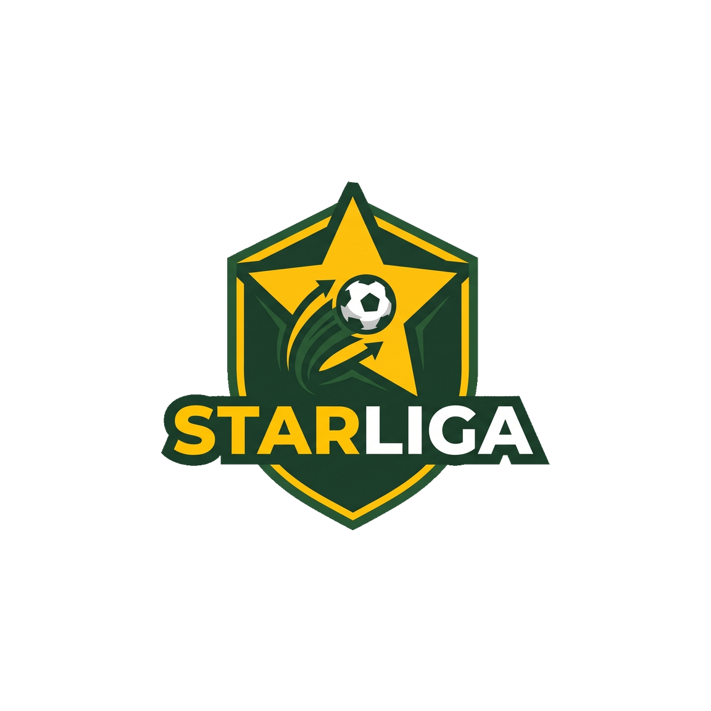 |
| **App Launcher Icon** | **Adaptive Foreground** | **Native Splash Screen** | **Android 12+ Splash Asset** |
| `assets/icons/app_icon.png` | `assets/icons/app_icon_foreground.png` | `assets/icons/splash_logo.png` | `assets/icons/splash_logo_android12.png` |
| `1024 × 1024 px` (RGB) | `1024 × 1024 px` (RGBA) | `1024 × 1024 px` (RGBA) | `1152 × 1152 px` (RGBA) |
| Primary standalone launcher icon with stadium pitch dark styling | Adaptive vector foreground layer for dynamic Android launcher icon shapes | Full-resolution brand identity emblem for seamless cold launch | High-density icon tailored with safe-zone margin for Android 12+ splash API |

---

<div align="center">
  
  <br/>
  <sub>Engineered with precision for football clubs, leagues, and enthusiasts.</sub>
</div>


